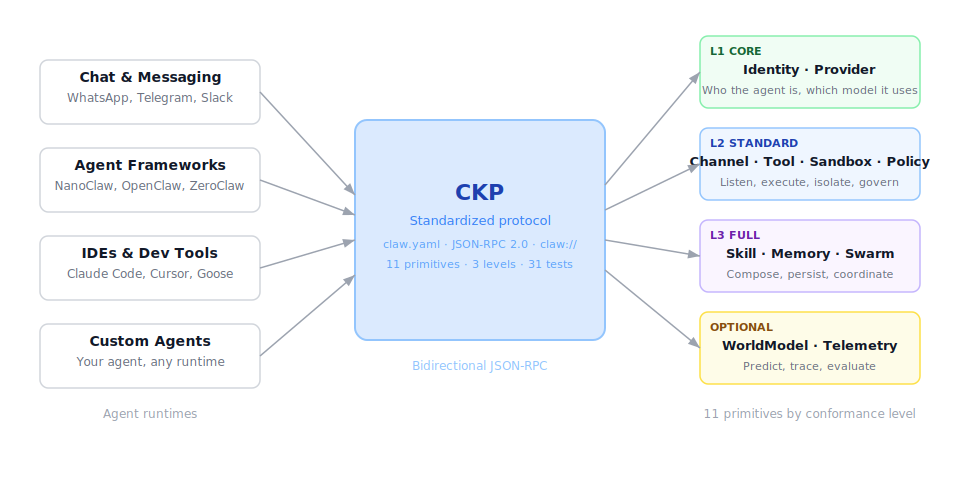

<p align="center">
  
</p>

<h1 align="center">ClawKernel</h1>

<p align="center">
  <code>$ claw --kernel</code>
</p>

<p align="center">
  <strong>Claw Kernel Protocol (CKP)</strong> — The missing protocol between AI agents
</p>

[](spec/clawkernel-spec.md)
[](LICENSE)
[](reports/coherence-report.md)
[](spec/)
[](https://www.npmjs.com/package/@clawkernel/sdk)

🌐 **Documentation:** [clawkernel.com](https://www.clawkernel.com/) · Built by [Datastrat](https://datastrat.co)

> **TL;DR** — CKP is to agent orchestration what MCP is to tool discovery. One YAML manifest describes your agent's identity, providers, tools, security, memory, and multi-agent coordination. One SDK implements the wire protocol. One test harness proves conformance.
>
> ```bash
> npm install @clawkernel/sdk
> ```

---

## What is CKP?

The Claw Kernel Protocol defines ten primitives for describing, composing, and interoperating autonomous AI agents. It provides a declarative manifest format (`claw.yaml`) with ABNF grammar, a JSON-RPC 2.0 wire format, and a `claw://` URI scheme for addressing agent components.

<p align="center">
  
</p>

CKP is complementary to MCP (Model Context Protocol). Where MCP standardizes how LLM hosts discover and invoke tools, CKP standardizes how autonomous agents are assembled, secured, and orchestrated as first-class runtime entities.

Three conformance levels (L1 Minimal, L2 Standard, L3 Full) allow implementations ranging from 4MB embedded binaries to enterprise swarm deployments.

---

## Why CKP?

The AI agent ecosystem is growing fast — OpenClaw, NanoClaw, IronClaw, PicoClaw, ZeroClaw, Nanobot — but every framework solves the same problems differently and none of them interoperate. Skills don't transfer. Security models vary wildly. Multi-agent coordination barely exists. Observability is an afterthought.

CKP exists to fix this. One manifest format. One wire protocol. Portable across any conformant runtime.

### Skills don't transfer across frameworks

A Gmail integration built for OpenClaw won't work in Nanobot. A web-scraping workflow from ZeroClaw can't run on NanoClaw. Every framework has its own skill format.

**→** The **Skill** primitive defines a universal format — description, tool dependencies, instructions, permissions, and I/O schemas — all in one portable YAML block. Write once, run on any CKP runtime.

### Multi-agent collaboration has no protocol

You want a research agent, a writer, and an editor working together — but there's no standard way to coordinate them.

**→** The **Swarm** primitive provides five topologies, four message-passing backends, aggregation strategies, and a wire protocol for task delegation, peer discovery, and result reporting.

### No structured observability

When your agent misbehaves at 3 AM, you can't trace why. No tracing across tool calls, no token dashboards, no cost tracking.

**→** The **Telemetry** primitive exports structured events to OpenTelemetry-compatible backends (Datadog, Jaeger, Grafana) with sampling control and automatic redaction of sensitive data.

### Security is a patchwork

OpenClaw uses application-level allowlists. NanoClaw uses OS containers. IronClaw built five security layers from scratch in Rust. There's no shared security language.

**→** **Policy** provides a declarative rule engine (allow/deny/require-approval/audit) with prompt injection detection, secret scanning, and rate limiting. **Sandbox** enforces per-tool isolation. Both are required at Level 2 — security isn't optional.

### No standard way to verify agent behavior

How do you prove your agent handles policy denials, tool timeouts, or sandbox violations correctly? Each framework tests differently, or not at all.

**→** CKP ships with **31 conformance test vectors** across three levels and a **coherence auditor** that validates spec consistency. Claim Level 2? Run the harness and prove it.

### Voice and multimodal are bolted on

Most frameworks are text-first. There's no standard for routing voice to the right model or handling image/video inputs.

**→** **Provider** declares capabilities (`text`, `image`, `audio`, `video`, `realtime`) and transport (`http`, `websocket`, `webrtc`). **Channel** supports `voice` as a first-class type. Runtimes route automatically — no custom plumbing.

### Running offline means reinventing the stack

PicoClaw targets $10 hardware. ZeroClaw embeds everything in SQLite. Each solves local-first differently with no shared contract.

**→** **Provider** supports local endpoints (Ollama, vLLM) with zero auth. **Memory** runs on SQLite. **Sandbox** works at process level. A valid L1 agent needs only Identity + Provider — no cloud, no Docker, no external dependencies.

---

## Primitives

| # | Primitive | Purpose |
|---|-----------|---------|
| 1 | **Identity** | Who the agent is — personality, context files, autonomy level |
| 2 | **Provider** | LLM inference endpoint — Claude, GPT, Ollama, local models |
| 3 | **Channel** | Ingress surface — Telegram, Slack, CLI, webhook, cron, queue, IMAP, db-trigger |
| 4 | **Tool** | Executable function with sandbox and policy bindings (supports `composite` flag) |
| 5 | **Skill** | Composed workflow built from multiple tools |
| 6 | **Memory** | Persistent state — conversation, semantic, key-value, workspace, checkpoint |
| 7 | **Sandbox** | Isolated execution environment with resource limits |
| 8 | **Policy** | Behavioral rules governing what an agent can and cannot do |
| 9 | **Swarm** | Multi-agent coordination across topologies |
| 10 | **Telemetry** | Structured observability — latency, cost, traces (optional at all levels) |

---

## Conformance Levels

| Level | Name | Required Primitives | Target |
|-------|------|---------------------|--------|
| **L1** | Core | Identity, Provider | Embedded devices, simple chatbots |
| **L2** | Standard | + Channel, Tool, Sandbox, Policy | Personal assistants, team bots |
| **L3** | Full | All nine core primitives (+Telemetry optional) | Enterprise swarms, multi-agent systems |

---

## Reading Order

1. **[Specification](spec/clawkernel-spec.md)** — Normative. The complete protocol definition: primitives, manifest format, ABNF grammar, JSON-RPC methods, security model, and conformance levels.

2. **[Runtime Profile](spec/clawkernel-runtime-profile.md)** — Informative. Recommended practices for implementers: defaults, retry semantics, transport extensions, secret resolution.

3. **[Test Vectors](spec/clawkernel-test-vectors.md)** — Informative. 31 conformance test vectors organized by level (L1 / L2 / L3).

4. **[JSON Schema + TypeScript](schema/0.2.0/)** — Canonical type definitions for all 10 primitives, the manifest, and JSON-RPC methods.

---

## Coherence Gate

The specification suite includes an automated 10-rule coherence auditor that validates cross-document consistency:

```bash
./tools/coherence-audit.sh spec/ reports/
```

Rules checked: error code coherence, method contracts, syntax validation (JSON/YAML/ABNF), normative boundary enforcement, cross-references, ABNF conformance, conformance level correctness, MUST coverage, field name consistency, and editorial consistency.

**Current result:** `PASS` — 0 critical, 0 minor.

**Requirements:** `bash`, `jq`, `python3` (with PyYAML), `perl`.

---

## Project Status

| Item | Status |
|------|--------|
| Specification | `v0.2.0` |
| Primitives defined | 10 (9 core + Telemetry, optional at all levels) |
| JSON-RPC methods | 15 specified |
| ABNF grammar | Complete |
| Test vectors | 31 (13 L1 + 10 L2 + 8 L3) |
| Error codes | 11 core |
| Coherence gate | 10 rules, PASS |
| JSON Schema | 12 schemas (10 primitives + manifest + definitions) |
| TypeScript types | `schema.ts` — canonical source of truth |
| Reference implementation | [`reference/ckp-bridge/`](reference/ckp-bridge/) — L1 CONFORMANT |
| SDK | [`sdk/`](sdk/) — `@clawkernel/sdk` — L1+L2+L3 (0 runtime deps) |
| Conformance harness | [`ckp-test`](https://github.com/angelgalvisc/ckp-test) — AJV + 31 vectors |
| Compatibility profiles | [`profiles/`](profiles/) — NanoClaw (L1 PARTIAL) |

---

## Quickstart

### Validate a manifest

```bash
# Install the conformance harness
git clone https://github.com/angelgalvisc/ckp-test.git
cd ckp-test && npm install && npx tsc

# Validate any claw.yaml
node dist/cli.js validate path/to/claw.yaml
```

### Test an agent for conformance

```bash
# Run L1 vectors against a stdio agent
node dist/cli.js run \
  --target "node path/to/your/agent.js" \
  --manifest path/to/claw.yaml \
  --level 1

# Expected output: 13/13 PASS → L1 CONFORMANT
```

### Reference bridge

The [`reference/ckp-bridge/`](reference/ckp-bridge/) directory contains a minimal L1 implementation (~215 lines of TypeScript) that passes all 13 L1 vectors:

```
✓ TV-L1-01 … TV-L1-13: 13/13 PASS
L1: CONFORMANT (0 skips, 0 fails, 0 errors)
```

Use it as a starting point for building your own CKP-conformant agent.

### SDK — From zero to conformant in 5 lines

The [`sdk/`](sdk/) directory provides `@clawkernel/sdk` — build a CKP-conformant agent at any level with zero runtime dependencies:

```typescript
import { createAgent } from "@clawkernel/sdk";

const agent = createAgent({
  name: "my-agent",
  version: "1.0.0",
  // Add tools, memory, swarm, telemetry for L2/L3
});

agent.listen(); // stdio JSON-RPC — ready for ckp-test
```

This gives you the full protocol stack out of the box: JSON-RPC 2.0 routing, lifecycle state machine, heartbeat, and the L2 tool execution pipeline (quota → policy → sandbox → approval → execute with timeout). You write handlers — the SDK handles the wire.

```bash
cd sdk && npm install

# Build library (dist/index.js)
npm run build

# Build library + examples (for testing)
npm run build:dev

# L1 agent: 13/13 PASS
node dist/examples/l1-agent.js

# L3 agent: 30 PASS + 1 SKIP → L3 PARTIAL
node dist/examples/l3-agent.js
```

See [`sdk/examples/`](sdk/examples/) for L1, L2, and L3 example agents with their manifests.

---

## Compatibility

| Agent | Level | Pass | Skip | Fail | Result |
|-------|-------|------|------|------|--------|
| [@clawkernel/sdk](sdk/) | L3 | 30 | 1 | 0 | **L3 PARTIAL** |
| [ckp-bridge](reference/ckp-bridge/) | L1 | 13 | 0 | 0 | **L1 CONFORMANT** |
| [NanoClaw](https://github.com/qwibitai/nanoclaw) | L1 | 4 | 9 | 0 | **L1 PARTIAL** |

See [`profiles/`](profiles/) for detailed compatibility assessments.

---

## Contributing

CKP is released. Feedback, issues, and proposals are welcome.

Before submitting changes to the specification, run the coherence gate and ensure it passes:

```bash
./tools/coherence-audit.sh spec/ reports/
# Must exit 0
```

---

## License

[Apache License 2.0](LICENSE)

---

**Author:** Angel Galvis Caballero — [Datastrat](https://datastrat.co)
